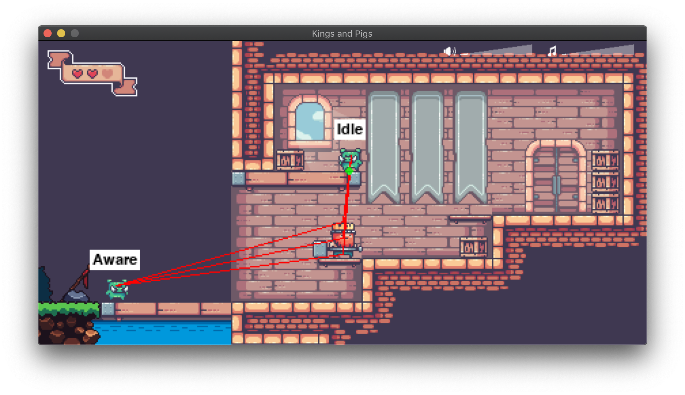

# Kings and Pigs


Аттестация преподавателей 2 года, проект PyGame

## Вдохновение

В поисках идеи, какую бы игру сделать в рамках проекта, я бродил и смотрел разные ассеты для игр (т.к. сам рисовать не умею).<br>
Так я нашёл абсолютно прекрасный набор [Kings and Pigs](https://pixelfrog-assets.itch.io/kings-and-pigs), распространяемый под CC0 лицензией. Который и определил то, что я буду делать :)

## ТЗ

Реализовать roguelike-платформер (рогалик). Roguelike значит, что смерть персонажа означает конец игры, сохраниений нет. Игра заканчивается либо смертью персонажа, либо победой.

Должны быть возможности поставить на паузу, завершить игру досрочно (выход), перезапустить игру с начала.

Должны быть экраны с названием игры (заставка), сообщения о победе или проигрыше, таблица рекордов.

По завершению игры игрок может ввести имя, и результат должен сохраниться в таблице рекордов.

В игре должны быть звуковое сопровождение и эффекты.

## Установка и запуск

Разработка велась в Python 3.9, но должно работать и в 3.7+.

Программа использует два сторонних пакета:
- pygame~=2.0.1 (для самой игры)
- PyTMX~=3.24 (для чтения карт уровней)

Чтобы установить зависимости, из корня проекта нужно запустить
```
pip install -r requirements.txt
```
(на некоторых системах может быть `pip3` вместо `pip`)

Программа оформлена как запускаемый пакет, запустить её можно двумя способами:

1. Первый способ (предпочтительный), из корня проекта запустить
```
python -m kings_and_pigs
```
(на некоторых системах может быть `python3` вместо `python`)

2. Второй способ, из корня проекта запустить
```
python launcher.py
```
(на некоторых системах может быть `python3` вместо `python`)

Второй способ также пригодится если нужно будет собирать исполняемый файл при помощи PyInstaller, т.к. он не поддерживает исполняемые модули (https://github.com/pyinstaller/pyinstaller/issues/2560)

## Игровой процесс

Я не стал делать возможность менять клавиши в настройках игры (в игре вообще нет настроек, кроме громкости музыки и звуковых эффектов).

В случае необходимости, любые клавиши можно переопределить в файле `events.py`, либо там же сделать обёртку для считывания/сохранения в базе данных.

Основные игровые клавиши:

- `стрелка вправо` — двигаться вправо
- `стрелка влево` — двигаться влево
- `стрелка вниз` — спрыгнуть с платформы
- `стрелка вверху` — зайти в дверь
- `пробел` — прыгнуть
- `Ctrl` / `X` — атаковать

Управляющие клавиши:

- `P` — пауза, включить/выключить
- `R` — перезапустить (требуется ответ `Y`/`N`)
- `Q` — выход из игры (требуется ответ `Y`/`N`)
- `N` — включить следующий фоновый музыкальный трек
- `M` — выключить/включить весь звук

Клавиши для отладки:

- `D` — включить/выключить информацию о поведении противников

Все клавиши на одной картинке:


Также в интерфейсе самой игры можно мышкой управлять громкостью музыки и звуковых эффектов:


## Описание поведения врагов

Для поведения врагов используется концепция машины состояний (стейт-машина, конечный автомат). Каждый враг, полностью видимый на экране, находится в одном из возможных состояний. Переключение между состояниями может происходит по триггеру, случайно или с течением времени.

Состояния врагов:

- `Idle` — бездействует. Может случайно поворачиваться в разные стороны, может случайно перейти в патрулирование.
- `Patrol` — патрулирует, либо от препятствия до препятствия (стена, конец платформы), либо на ограниченном участке. Может случайно перейти в бездействие.
- `Aware` — увидел героя. В зависимости от типа врага может случайно подобрать ближайший ящик или бомбу, или сразу пойти атаковать.
- `Pick` — пошёл подбирать ближайший яшик или бомбу.
- `Search` — после того, как подобрал предмет, возвращается на позицию, где видел героя, чтобы атаковать. Если видит героя раньше — сразу атакует. Если не видит героя какое-то время, переходит в замешательство.
- `Attack` — атакует. Если несёт предмет — пытается подойти на нужное расстояние и бросить предмет. Если не несёт предмет — пытается сблизиться с героем и ударить. Если герой находится выше или ниже — случайно может прыгать, чтобы преодолеть вероятное препятствие/подняться на платформу.
- `Confuse` — в замешательстве. Может увидеть героя или перейти в патрулирование.

Картинка с переходами между состояниями:


Для отслеживания, видит враг героя или нет, используется три луча и их пересечения со стенами и платформами. Если хотя бы один луч между врагом и героем не перекрывается ни стеной, ни любой платформой — считается, что враг видит героя.

Нажатием кнопки `D` можно включить/выключить отображение лучей взгляда, пересечения лучей со стенами и платформами, а также текущее состояние врагов.



## Карта

Как таковых, уровней с различной сложностью в игре нет. Вся карта представляет собой один за́мок, состоящий из различных комнат. Смена комнат осуществляются через двери или бесшовные переходы.

Все помещения нарисованы вручную в редакторе [Tiled](https://www.mapeditor.org). Неплохо было бы иметь возможность процедурной генерации, но мне кажется, это потянет на отдельный проект.

Вся информация о помещении — стены, поверхности от которых можно прыгать, двери, объекты, враги и тд — хранится в самой карте в виде различных слоёв. Это позволяет очень просто и быстро создавать новые помещения и связывать их с существующими, вообще без программирования.

Карту всего за́мка можно посмотреть в файле [screenshots/map.jpg](./screenshots/map.jpg), если вы хотите самостоятельно его исследовать и вам не нравятся спойлеры — не смотрите :)

## Окончание игры

У игры два возможных исхода — победа или смерть (проигрыш). Смерть наступает либо когда кончаются три жизни, либо при падении за пределы карты. Для победы нужно найти врага-босса (короля-свина) и победить его.

При обоих исходах игрок вводит своё имя для таблицы рекордов. В таблице рекордов отображаются топ-10 игроков по количеству собранных камней. При этом игроки, закончившие игру смертью персонажа, помечаются могильными камнями. У победивших такой отметки нет.


## База данных

В базе данных две несвязанные между собой таблицы:

- `score` — здесь хранится таблица рекордов
- `settings` — здесь хранятся настройки (в данный момент только громкость и статус вкл/выкл для музыки и звуков)


## Диаграмма классов и пакетов

(Не уверен, будет ли полезно и читаемо, построено автоматически при помощи `pyreverse`, но может быть будет интересно с архитектурной точки зрения)<br>
(Удобнее смотреть открывая файлы напрямую, чем здесь)


## Комментарии

В одном из отзывов к моему первому проекту (PyQT) одного из проверяющих "смутили комментарии в коде на английском языке" (почти цитата).<br>
Хочу пояснить, что я программист с 15-летним профессиональным стажем (правда не на питоне, и это ни в коем образе не апелляция к авторитету, а просто констатация факта), и комментарии в коде на русском языке вызывают у меня органическое отторжение. Английский язык международный и де-факто язык всей ИТ индустрии.<br>
А не признак копирования кода откуда либо :) Хотя, конечно, я смотрел различные реализации игр на PyGame, помимо курса Яндекс.Лицея, чтобы написать свою игру, особенно большое влияние на общий подход к архитектуре оказал [этот учебный проект](https://github.com/joncoop/pygame-platformer).

## Использованные ресурсы

Основные тайлы и спрайты для замка, героя, врагов и окружения:<br>
https://pixelfrog-assets.itch.io/kings-and-pigs <br>
(Лицензия CC0)

Тайлы и спрайты для внешнего мира (трава, деревья, вода, подземелье):<br>
https://oddpotatogift.itch.io/32x32-platformer <br>
(Лицензия Free)

Звуковые эффекты (герой, враги):<br>
https://cicifyre.itch.io/rpg-voice-starter-pack <br>
(Лицензия CC0)

Звуковые эффекты (взрыв):<br>
http://www.themotionmonkey.co.uk/free-resources/retro-arcade-sounds/ <br>
(Лицензия CC0)

Звуковые эффекты (открытие/закрытие дверей):<br>
https://opengameart.org/content/door-open-door-close-set <br>
(Лицензия Free)

Иконки (звука и музыки):<br>
https://gamedeveloperstudio.itch.io/icon-pack <br>
(Лицензия Free)

Шрифт:<br>
https://www.ffonts.net/Phorfeit-Regular-BRK.font <br>
(Лицензия Free)

Музыка:<br>
Рип из игры "[Tzar - The Burden Of The Crown](https://ru.wikipedia.org/wiki/Tzar:_Burden_of_the_Crown)" <br>
http://www.mirsoft.info/gmb/music_info.php?id_ele=MTM0ODE <br>
https://www.youtube.com/watch?v=Bg6e5iR50NM <br>
(Композиторы Kiril Petrushev, Dimitar Sabev) <br>
([Haemimont Games](https://www.haemimontgames.com))

Возможно забыл какие-то одиночные файлы, не уверен...
